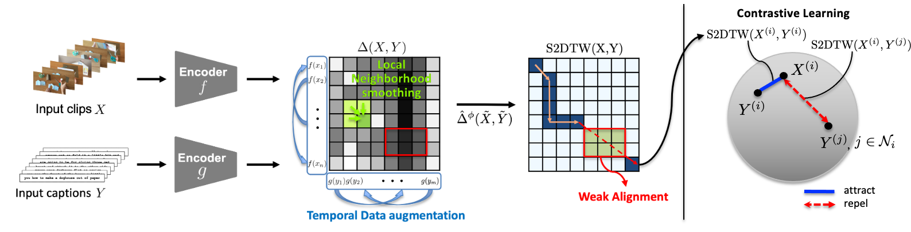

# VT-TWINS

This repositoriy is the implementation of "[Video-Text Representation Learning via Differentiable Weak Temporal Alignment](https://openaccess.thecvf.com/content/CVPR2022/papers/Ko_Video-Text_Representation_Learning_via_Differentiable_Weak_Temporal_Alignment_CVPR_2022_paper.pdf) (CVPR 2022)".

<div align="center">
  
</div>

## Preparation

### Requirements
- Python 3
- PyTorch (>= 1.0)
- [python-ffmpeg](https://github.com/kkroening/ffmpeg-python) with ffmpeg 
- pandas
- numpy
- tqdm
- scikit-learn
- numba 0.53.1

### Dataset
The annotation files (.csv) of all datasets are in './data'. If you download the downstream datasets, place the files as follows:
```
data
 |─ downstream
 │   |─ ucf
 │   │   └─ ucf101
 |   │       |─ label1
 |   │           |─ video1.mp4
 |   │           :
 |   │       :
 |   |─ hmdb
 |   │   |─ label1
 |   │   │   |─ video1.avi
 |   │   │   :
 |   │   :
 |   |─ youcook
 |   │   |─ task1
 |   │   │   |─ video1.mp4
 |   │   │   :
 |   │   :
 |   |─ msrvtt
 |   │   └─ TestVideo
 |   │       |─ video1.mp4
 |   │       :
 |   └─ crosstask
 |       └─ videos
 |           |─ 105222
 |           │   |─ 4K4PnQ66LQ8.mp4
 |           │   :
 |           :
 ```

### Pretrained Weight
The pretrained weight of our model, word2vec, and the tokenizer can be found in [here](https://drive.google.com/drive/folders/16QH4C6Sr6ptGp-wEnVsAwZem-kp-uLkt?usp=sharing). Place the pretrained weight of our model in the './checkpoint', and word2vec and the tokenizer in the './data'.

## Evaluation

### Action Recognition on UCF101
```
python src/eval_ucf.py --pretrain_cnn_path ./checkpoint/pretrained.pth.tar
```

### Action Recognition on HMDB
```
python src/eval_hmdb.py --pretrain_cnn_path ./checkpoint/pretrained.pth.tar
```

### Text-to-Video Retrieval on YouCook2
```
python src/eval_youcook.py --pretrain_cnn_path ./checkpoint/pretrained.pth.tar
```

### Text-to-Video Retrieval on MSRVTT
```
python src/eval_msrvtt.py --pretrain_cnn_path ./checkpoint/pretrained.pth.tar
```

### Action Step Localization on CrossTask
```
python src/eval_crosstask.py --pretrain_cnn_path ./checkpoint/pretrained.pth.tar
```

## Citation
```
@inproceedings{ko2022video,
  title={Video-Text Representation Learning via Differentiable Weak Temporal Alignment},
  author={Ko, Dohwan and Choi, Joonmyung and Ko, Juyeon and Noh, Shinyeong and On, Kyoung-Woon and Kim, Eun-Sol and Kim, Hyunwoo J},
  booktitle={Proceedings of the IEEE/CVF Conference on Computer Vision and Pattern Recognition},
  year={2022}
}
```